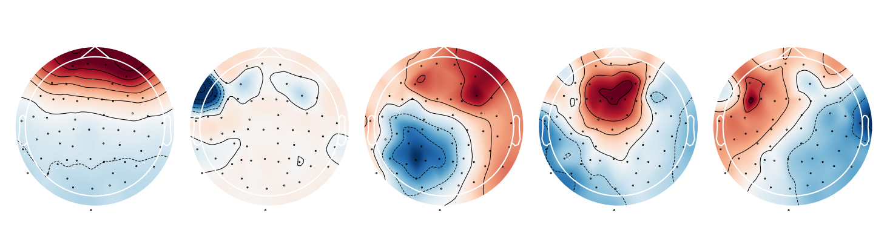
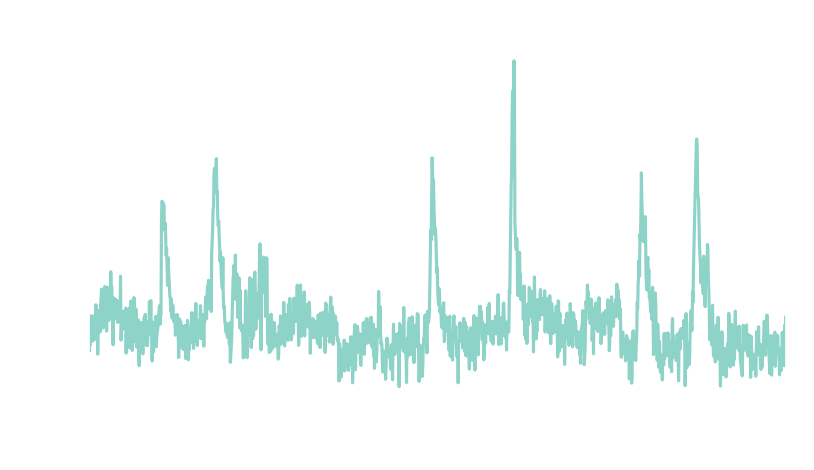
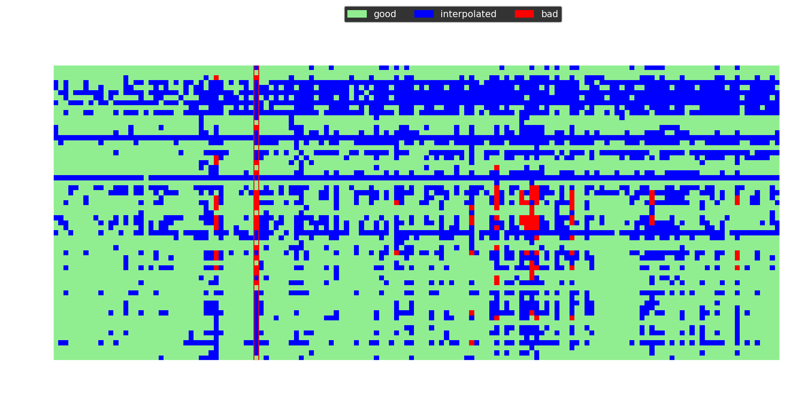

+++
title = "EEG preprocessing II: eye-artifacts, repairing and rejecting"
date = "2024-02-23T12:53:03-05:00"
cover = "posts/eeg_preprocessing2/ica_components.png"
tags = ["Python", "EEG", "signal processing"]
description = "Part 2"
+++

The [previous post on preprocessing EEG](posts/eeg_preprocessing) presented a minimally invasive pipeline of procedures that are necessary in most EEG analyses. In this post I present additional steps that might be useful if the data is still not **sufficiently cleaned**. First, I will address **eye blinks** which is one of the most prevalent sources of artifacts in EEG recordings. After that, I'll demonstrate a method to repair or remove segments of the data **contaminated with noise**. The examples assume that the data was cleaned and epoched as outlined in [part I](posts/eeg_preprocessing).

# What are eye artifacts?
While it is often assumed that eye artifacts are the result of muscle activity, they are actually the result of a **ionic gradient** in the retinal pigment epithelium that makes the eye an **electric dipole** [^1]. Thus, moving the eyes and the dipole **induces** a change in voltage picked up by the sensors that is roughly proportional to the **amplitude** of the movement. Because this could overshadow the neural responses, many studies eliminate eye movements by making participants **fixate** a point during the experiment.

However, another kind of eye artifact may still occur - **blinks**. Eye blinks affect the measured voltage because the eye lid **changes the resistance** between the positively charged cornea and the forehead. Fortunately, these eye artifacts are largely **independent** of each other and the brain activity which makes them ideal candidates for independent component analysis (ICA) [^2].

# Identifying eye-blink components with ICA
ICA is an algorithm that finds a rotation matrix to separate the sensor data into components that are **mutually independent** [^3].
In the code below, I fit an ICA to the epoched data. At maximum, ICA can capture as many components as there are channels [^4]. However, usually the data can be captured with **fewer components**. When the `n_components` parameter is set to a decimal number, the ICA will compute as many components as are necessary to explain this share of the total variance in the data. The components will be ordered by **explained variance** and I am plotting the first five of them below.

```python
from mne.preprocessing import ICA
ica = ICA(n_components=0.99)
ica.fit(epochs)
ica.plot_components(range(5))
```

Each component is a **linear combination** of all channels and the weights indicate how much each channel affects that component [^5]. The first components depends almost solely on the **frontal channels** - a strong indicator that it represents eye-blink artifacts! 



Another way to characterize the components is to obtain their **time course** by filtering the EEG signal using the component weights. The resulting time series is called the **component loading** and indicates the presence of that component in the data across time. In the code below, I compute the loading for all ICA components, select the first one and plot it after concatenating all epochs.

```python
import numpy as np
from matplotlib import pyplot as plt
src = ica.get_sources(epochs)
src = src.get_data()[:,0,:].flatten()
times = np.linspace(0, len(src)/epochs.info['sfreq'], len(src))
plt.plot(times, src)
plt.xlim(40,50)
plt.ylim(-2, 8)
plt.xlabel('Time [s]')
plt.ylabel('Component loading [a.u.]')
plt.title('ICA000')
```

The component loading is mostly flat except for **large amplitude spikes** - exactly what is expected from a signal that represents discrete eye blinks. After ensuring that the component captures blinks it can be removed from the data.



# Automated component rejection
One could simply select and remove the eye blink component from the data. However, manual selection of components goes against the idea of an automated preprocessing pipeline. Instead, we can use the selected component as a **template** and classify new components as blinks by using the `corrmap` algorithm which selects components who's **correlation** with the template exceeds some **threshold** [^6]. To do this we can can store the blink component's index in the `ICA.labels_` attribute and save the ICA as template.

```python
import tempfile
temp_dir = tempfile.TemporaryDirectory()
template = ica.copy()
template.labels_['blinks'] = [0]
template.save(temp_dir.name + '/template_ica.fif')
```

Now we can iterate through all entries in the `.labels_` attribute and use `corrmap` to find components that are **similar** to the respective template. The first input for `corrmap` is the list of ICAs being processed. The second input is a tuple with the index of the ICA instance in the list and the component of that ICA being used as **template**. Similar components that are detected are stored in the `.labels_` attribute of the respective ICA instance.

```python
from mne.preprocessing import read_ica, corrmap
template = read_ica(temp_dir.name + '/template_ica.fif')

for key, value in template.labels_.items():
    corrmap([template, ica], (0, value[0]), label=key, threshold=0.85, plot=False)

print(ica.labels_)
```

Of course, this example is completely circular because we applied `corrmap` to the same data we used for selecting the template in the first place. However, once selected, the same template can be applied to **multiple recorings** and even **across experiments**, given that the electrode layout is the same. After all artifact components have been identified, we can exclude them when **applying** the ICA to the sensor data.

```python
bad_components = [value[0] for value in ica.labels_.values()]
epochs.load_data() # make sure data is loaded
epochs = ica.apply(epochs, exclude=bad_components)
```

# When data must be rejected
Even with all the preprocessing steps discussed in this guide, some data can't be saved.
Sometimes, a channels **loses contact** with the scalp or a segment is noise-ridden, for example due to **excessive movement**. In those cases, we have to remove that data so it won't **contaminate** the average response. Traditionally, EEG data is **manually inspected**, bad channels are interpolated and bad segments are annotated for rejection by hand. This is suboptimal for several reasons: first, scanning tens of hours of EEG recordings is tedious, **time consuming** and unfeasible for very large data sets. What's more, the manual approach **reduces reproducibility** because the criteria for what counts as a bad channel or segment are subjective. Finally, it is often not necessary to interpolate a channel for the entire recording if it is bad for **only a fraction**.

# Introducing autoreject
All of these problems are addressed by the `autoreject` algorithm [^7], which is a procedure to identify and either **repair or reject** bad data segments. For each channel p, it estimates a peak-to-peak **threshold** &tau;. Each channel marks epochs as bad that exceeds their respective threshold. A trial is rejected if a **fraction &kappa;** of all channels marks it as bad. If less than &kappa; channels are bad, up to **&rho; are interpolated** to repair the epoch. All parameters, &tau; &kappa; and &rho; are **estimated from the data** using cross-validation. Thus the optimal set of parameters are those that **minimize the difference** between testing and training data. In this sense, `autoreject` acts similar to a **human observer** identifying outliers in the data. After installing the module with `pip install autoreject`, we can simply apply it to the epoched data. I also plot the **rejection log** to visualize the effect of `autoreject` on the data.

```python
from autoreject import AutoReject
ar = AutoReject()
epochs, log = ar.fit_transform(epochs, return_log=True)
log.plot(orientation='horizontal')
```

In the plot below, blue marks channels that have been **interpolated** within a given epoch. Red marks channels that have been deemed bad but not interpolated because the number of bad channels **exceeded &rho;**. The red column at epoch 40 indicates that this epoch has been **rejected** because the number of bad channels **exceeded &kappa;**.



# Conclusion
The repertoire of preprocessing methods outlined in this and the previous post is sufficient to clean data for most EEG projects. Importantly, all steps can be assembled into a **fully automated** pipeline. In the next and final post in this series, I will share a such a pipeline and demonstrate a method for estimating the **effectiveness** of each step.

# Footnotes
[^1]: This is referred to as the corneo-retinal dipole. A explanation of the underlying physiology can be found in: *Arden, G. B., & Constable, P. A. (2006). The electro-oculogram. Progress in retinal and eye research, 25(2), 207-248.*

[^2]: A detailed investigation of eye-artifacts and their detection via ICA can be found in: *Plöchl, M., Ossandón, J. P., & König, P. (2012). Combining EEG and eye tracking: identification, characterization, and correction of eye movement artifacts in electroencephalographic data. Frontiers in human neuroscience, 6, 278.*

[^3]: An in-depth explanation of ICA is beyond the scope of this post but can be found in: *Makeig, S., Bell, A., Jung, T. P., & Sejnowski, T. J. (1995). Independent component analysis of electroencephalographic data. Advances in neural information processing systems, 8.*

[^4]: However, interpolating bad channels reduces the number of possible components because interpolated channels contain no unique information.

[^5]: The absolute sign of the component is meaningless and may change when ICA is performed repeatedly.

[^6]: A detailed description of the corrmap algorithm can be found in *Viola, F. C., Thorne, J., Edmonds, B., Schneider, T., Eichele, T., & Debener, S. (2009). Semi-automatic identification of independent components representing EEG artifact. Clinical Neurophysiology, 120(5), 868-877.*

[^7]: A detailed description of the autoreject algorithm can be found in *Jas, M., Engemann, D. A., Bekhti, Y., Raimondo, F., & Gramfort, A. (2017). Autoreject: Automated artifact rejection for MEG and EEG data. NeuroImage, 159, 417-429.*


