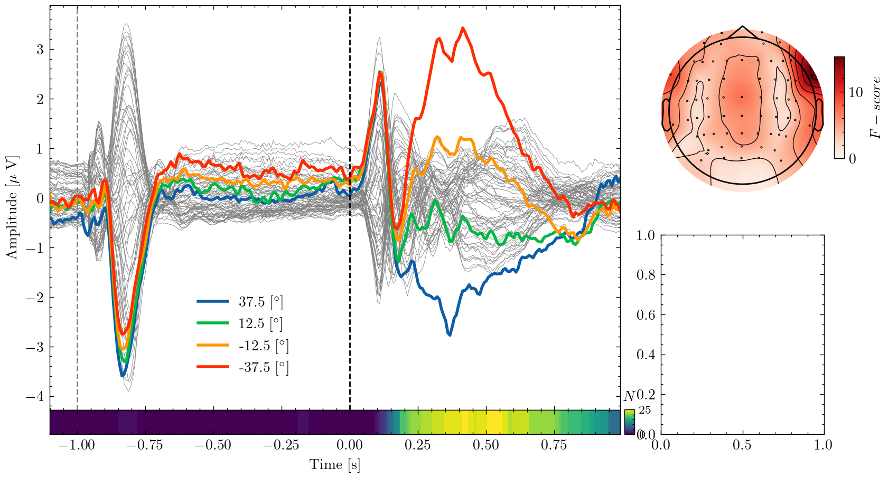
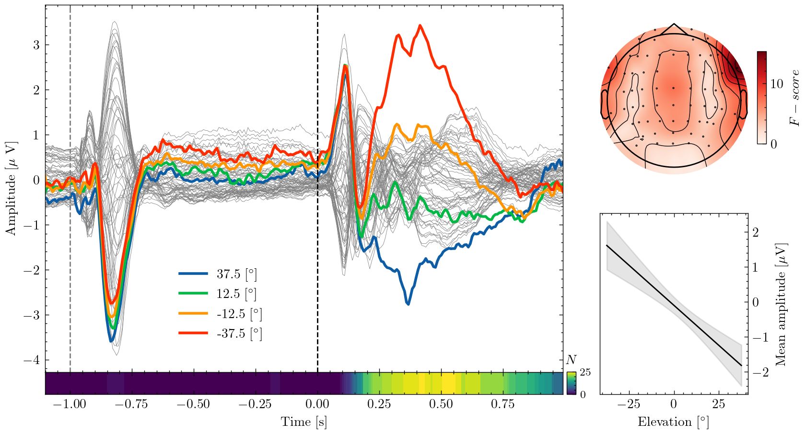

+++
title = 'Making publication-ready figures with Matplotlib'
date = 2023-10-01T21:37:12-04:00
draft = false
tags = ['Python', 'science', 'visualization']
cover = 'posts/matplotlib/plot5.png'
+++

"An image says more than a thousand words" is a platitude, but when it comes to **communicating** the results of your research it is definitely true.
Figures are probably the most important part of a paper and most readers will **first** look at them before reading the text in detail. In this blog post I'll show how to use the Python library **Matplotlib** for creating publication-ready figures.
For this purpose I'll reproduce a figure from a [recent paper](https://www.biorxiv.org/content/10.1101/2023.05.03.539222v1.abstract) step-by-step.

# Prerequisites
In this blog post I will use the Python library Matplotlib and reproduce the figure in the title step-by-step.
If you want to follow along, you can download the data by [clicking here](/example_data.npy) or use Python to fetch it:

```sh
pip install matplotlib numpy mne
```

The package `mne` is only required to draw the scalp map (a common visualization in EEG research) in panel **B** of the figure.
If you don't want to reproduce that subplot, you may skip installing `mne`.
You'll also need the **data** which you can download by [clicking here](\example_data.npy) or fetch using Python:

```python
import requests
from io import BytesIO
import numpy as np

response = requests.get("https://olebialas.github.io/example_data.npy")
d = np.load(BytesIO(response.content), allow_pickle=True).item()
```

# Data
The data contains the **neural activity**, and some derived statistics, of participants who **localized sounds** played from different locations. 
Because this blog post focuses on visualization, I'll not explain the scientific details.
If you are interested you may have a look at the [paper](https://www.biorxiv.org/content/10.1101/2023.05.03.539222v1.abstract).
Let's look at the **content** of our data by printing the dictionary's keys and the shape of the array stored under them:

```python
for key, value in d.items():
 print(f"{key}: {value.shape}")
```
```sh
times: (269,)
eeg_avg: (269, 64)
eeg_con: (269, 4)
con: (4,)
ch_f: (64,)
ch_loc: (64, 2)
n_sig: (269,)
line_y: (10000, 100)
line_x: (100,)
```

- `times` is a vector of time points at which the EEG data are sampled
- `eeg_avg` is a matrix with the average EEG recording of each channel
- `eeg_con` contains the recording of a single channel for each condition.
- `con` stores the conditions (i.e. the elevation of the different sound sources)
- `ch_f` and `ch_loc` contain the F-values (a statistic indicating the separation of responses to the different conditions) and x,y coordinates for each EEG channel.
- `n_sig` contains the number of subjects for which a statistical test found a significant difference between conditions at each point in time.
- `line_y` contains samples from a linear model for the relationship between sound source elevation and neural response amplitude
- `line_x` contains the x-coordinates (i.e. elevations) the values where sampled at


# Style templates
Matplotlib is great, but the default style is not exactly pleasing to the eye.
Fortunately there are some fantastic templates that you can use instead.
I like to use ["SciencePlots"](https://github.com/garrettj403/SciencePlots) which has an elegant and professional look and even offers the option to emulate the style of several academic journals.
To use the style template, install it as a package with `pip install SciencePlots`, import it and set it as Matplotlib's style:

```python
from matplotlib import pyplot as plt
import scienceplots

plt.style.use('science')
```

# Subplot spacing
I want to allocate most of the figure's space to the time series data in panel **A**, while the scalp map in **B** and the regression line in **C** can smaller.
We can create subplots of different size using the `subplot_mosaic()` function.
This function takes a nested lists of strings where each **unique** string represents one subplots and it's **repetitions** define the fraction of the figure that subplot occupies.
Its a good idea to use capital letters because we can use those later to label the panels.

```python
fig, ax = plt.subplot_mosaic(
    [
        ["A", "A", "A", "B"],
        ["A", "A", "A", "C"],
    ],
    figsize = (8, 4.5)
)
plt.subplots_adjust(wspace=0.25, hspace=0.15)
```

This creates a figure where panel **A** spans two rows and three columns while **B** and **C** only occupy a single element.
The function `subplots_adjust` changes the spacing by adjusting the width (wspace) and height (hspace) of subplots' padding.


# Highlighting what's important
Let's plot the time series data to panel A.
First I plot the **average** EEG for each recorded channel in **gray** with small line width.
Next, I iterate through the four experimental conditions and plot each one **individually** which makes Matplotlib use a different **color** for each.
Using gray and colors as well as different line width is a good way of giving a detailed **overview** of the data while **highlighting** important aspects.

```python
ax["A"].plot(d["times"], d["eeg_avg"], color="gray", linewidth=0.3)
for i_con in range(d["eeg_con"].shape[1]):
    ax["A"].plot(
        d["times"], d["eeg_con"][:, i_con],
        linewidth=2, label=f"{d['con'][i_con]} [$^\circ$]"
        )
ax["A"].legend(loc=(0.25, 0.07))
ax["A"].set(ylabel="Amplitude [$\mu$ V]", xlim=(d["times"].min(), d["times"].max()))
```

By **labeling** each conditions line with the respective sources elevation, we can create an informative legend.
The last line is labeling the y-axis and **adjusting** the x-axis to the recorded time interval.
Putting **dollar** signs around string, tells Matplotlib to render them with LateX which allows us to use equations and **special symbols** like Greek letters.
If you don't have a LateX installed, you'll have to  change those strings.

# Marking time points
In the experiment, participants heard **two** subsequent sounds.
Let's mark the sound onsets so we can see how the neural response **relates** to the stimuli.
The `.axvline()` method takes a point on the x-axis and draws a vertical line between `ymin` and `ymax`. Here, x is in **data coordinates** (i.e. seconds) while the y coordinates are expressed as a fraction of the axis.

```python
ax["A"].axvline(x=0, ymin=0, ymax=1, color="black", linestyle="--")
ax["A"].axvline(x=-1, ymin=0, ymax=1, color="gray", linestyle="--")
```


# Adding subplots
In the study, we ran a statistical test for **differences** between the responses to the different sound sources at each point in time.
I want to visualize the **number** of participants for whom the test found a significant result using a heat map.
To do this, we can use the `makes_axes_locatable()` function which returns an `AxesDivider` that allows us to split off a new subplot
    
```python
from mpl_toolkits.axes_grid1 import make_axes_locatable

divider = make_axes_locatable(ax["A"])
new_ax = divider.append_axes("bottom", size="6%", pad=0)
```

This adds a subplot to the bottom of panel **A** whose size is equal to six percent of the original subplot and adds it to the `ax` dictionary. Now we can plot our **heat map** to the new subplot.

```python
extent = [d["times"].min(), d["times"].max(), 0, 1]
im = new_ax.imshow(d["n_sig"], aspect="auto", extent=extent)
new_ax.set(xlabel="Time [s]", yticks=[])
```

The images `extent` are the data coordinates that the image will fill and setting the `aspect="auto"` allows non-square pixels to fit the axis.

Now the heat map needs a color bar that explains what the colors **represent**.
The color bar should be short and tucked to the side of the heat map.
The most easy way to create a subplot is to **directly** define its location.
The `add_axis()` method takes as inputs the x and y coordinate of the new subplot's left bottom corner and its width and height **relative** to the whole figure.

After creating the subplot we can use the `colorbar()` function on the image returned by `imshow()`. Finally, we can adjust the font and tick size.

```python
cax = fig.add_axes([0.7, 0.11, 0.01, 0.048])
fig.colorbar(im, cax=cax, orientation="vertical", ticks=[0, d["n_sig"].max()])
cax.set_title("$N$", fontsize="medium")
cax.tick_params(labelsize=8)
```


The **downside** of manually positioning the color bar is that you have to try around to find the right coordinates. This can be made a little easier using Matplotlib's **interactive** mode by calling `plt.ion()`.
In interactive mode, all plotting commands are immediately executed so you can see where an object is located.

# Hiding the axis
The scalp plot in panel B doesn't need the surrounding axes.
We can turn them **off** before plotting.
Then we can create the scalp map, using a function from the [MNE](https://mne.tools/stable/index.html) toolbox and add a color bar just as we did before.

```python
from mne.viz import plot_topomap
im, _ = plot_topomap(d["ch_f"], d["ch_loc"], show=False, axes=ax["B"])
cax = fig.add_axes([0.91, 0.65, 0.01, 0.2])
cbar = fig.colorbar(im, cax=cax, orientation="vertical")
cbar.set_label("$F-score$")
```



# Displaying uncertainty
Panel C contains samples from a linear model which describes the relationship between neural response amplitude and sound elevation.
The regression model was computed 10k times using [bootstrapping](https://en.wikipedia.org/wiki/Bootstrapping_(statistics)) and the variability across these models indicates the uncertainty surrounding the estimated relationship.

We can visualize this uncertainty by **shading** an area around the mean of all models. Here, I use +/- two **standard deviations** which encompasses 99.7% of all observed values. Setting the opacity `alpha` to a low level creates a shade rather than solid color.

```python
mean, std = d["line_y"].mean(axis=0), d["line_y"].std(axis=0)
ax["C"].plot(d["line_x"], mean, color="black")
ax["C"].fill_between(d["line_x"], mean + 2 * std, mean - 2 * std, alpha=0.1, color="black")
ax["C"].set(ylabel="Mean amplitude [$\mu$V]", xlabel="Elevation [$^\circ$]")
```

Finally, we can move the y-axis ticks and label to the right so it does **not overlap** with other subplots

```python
ax["C"].yaxis.tick_right()
ax["C"].yaxis.set_label_position("right")
```



# Labeling subplots
The only thing left to do is labeling the panels so we can refer to them in text.
One practical option is to use the **keys** from the `ax` dictionary as labels and put them at the same location relative to each axis.
Because the `text()` method treats x and y values as data coordinates per default, we have to use the `transAxes` transform.

```python
for label in ax.keys():
    if label.isupper():
        ax[label].text(-0.06, 1, label, transform=ax[label].transAxes, font='bold')
```


# Saving
When saving the figure as an image, make sure to use a sufficiently **high** number of dots per inches (`dpi`) so it looks nice printed.
Also, **don't** change the image's height or width after saving the image because it will make the font size vary across figures.
Instead use the `figsize` attribute to create figures of the desired size.
It is possible to remove the margins by setting `bbox_inches="tight"` but be aware that this may **change** the defined `figsize`.

```python
fig.savefig('awesome_figure.png', dpi=300, bbox_inches='tight'
```

Now the figure is ready for publication!
