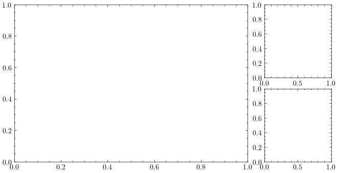
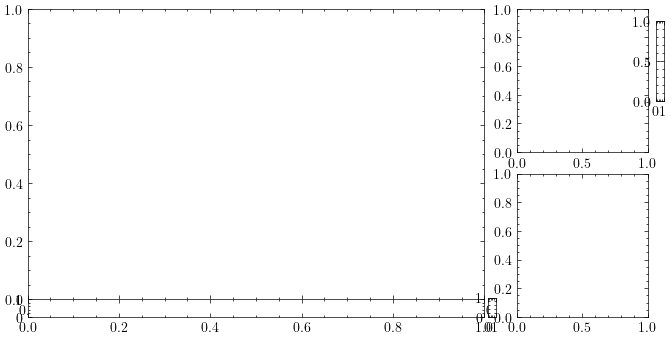
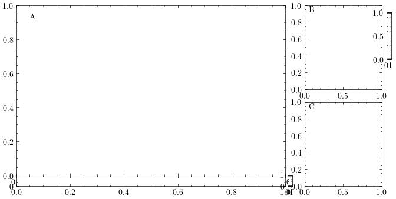

+++
title = 'Making publication-ready figures with Matplotlib'
date = 2023-10-26T21:37:12-04:00
draft = false
tags = ['Python', 'science', 'visualization']
cover = 'posts/matplotlib/example.png'
+++

"An image says more than a thousand words" is a platitude, but when it comes to communicating the results of your research it is definitely true. Figures are probably the most important part of a paper and most readers will first look at them before reading the text in detail. 

In this blog post I will use the Python library Matplotlib and reproduce the figure in the title step-by-step.
If you want to follow along, you can download the data by [clicking here](\example_data.npy) or use Python to fetch it:

```python
import urllib
print()
```

The data contains electroencephalographic (EEG) recordings of participants who localized sounds played from different positions. I won't explain the results (if interested, see [this paper](https://www.biorxiv.org/content/10.1101/2023.05.03.539222v1.abstract), but instead focus on visualizing them.


# Why do this?
Why should you write code to generate your figures rather than arranging them with a graphical design program (that you may already be familiar with)? I think that there are several good reasons:

1. **Reproducibility**: Removing the need to point and click at things allows you to build an end-to-end pipeline that generates figures directly from your data. If you share your code and data, this will allow others to reproduce your findings, making them more transparent and trustworthy.
2. **Productivity**: While getting good at using Matplotlib will take time initially, it will increase your productivity in the long run. That is because most scientific figures are somewhat similar and you will be able to reuse the same code snippets over and over again (I very rarely start any figure from scratch).
3. **Aesthetics**: With Matplotlib's formatting options and custom-made designs you will be able to create beautiful figures, even if design isn't your strong suit!

# Find your style
Matplotlib is great, but the default theme is not exactly pleasing to the eye. Fortunately, you can customize every little aspect using Matplotlib's [rc (runtime configuration) parameters](https://matplotlib.org/stable/users/explain/customizing.html). But you actually don't have to configure everything yourself - out there are fantastic custom-made themes that you can simply import and use. I like to use ["SciencePlots"](https://github.com/garrettj403/SciencePlots) by John Garret which has a clean and professional look, perfectly suited for scientific publications. It's very simple, just do `pip install SciencePlots` and set the theme before plotting.

```python
from matplotlib import pyplot as plt
import scienceplots

plt.style.use('science')
```
Boom! Your plots just became 200% better!

# The basic layout
To set the basic layout of the plot, we will use `plt.subplot_mosaic()` which pretty intuitive, yet provides a lot of flexibility. This function takes a list of lists where all elements are strings and each unique string defines one subplots. The occurrences of the same string define the space that plot occupies. To get a layout similar to the example we can do something like this:

```python
fig, ax = plt.subplot_mosaic(
    [
        ["A", "A", "A", "B"],
        ["A", "A", "A", "C"],
    ],
)
plt.subplots_adjust(wspace=0.25, hspace=0.15)
```


The plots on the left spans two rows and three columns while the plots one the right span only one row and one column. The dictionary `ax` contains handles for all subplots, which can be addressed by their keys - for example `ax["A"].plot()` will plot to the left subplot. You can name the subplots any way you want but I recommend using capital letters because we can use those for labeling later. The function `plt.adjust_subplots()` allows us to adjust the layout by changing the with (`wspace`) and height (`hspace`) of the padding between subplots so that the axes won't overlap.

# Step 3: control
There are some elements in the example plot that require more fine-grained control than `plt.subplot_mosaic()` can offer. To create a subplot for the horizontal bar below panel **A** in the example, we can use a function called `makes_axes_locatable()` which returns an `AxesDivider` that allows us to create a new subplot by splitting an existing one:

```python
from mpl_toolkits.axes_grid1 import make_axes_locatable

divider = make_axes_locatable(ax["A"])
ax["a"] = divider.append_axes("bottom", size="6%", pad=0)
```

This adds a subplot to the bottom of panel **A** whose size is equal to six percent of the original subplot and adds it to the `ax` dictionary. However, sometimes we don't want the new subplot to have the same width or height as an existing one. In this case, we can use the `fig.add_axes()` method which takes four numbers representing the figures left border, bottom border, width and height. All of these measures are relative to the size of the figure - the whole figure, not a single subplots. This gives us complete freedom for positioning the subplot, but it requires some trial and error to fin the right position. I recommend to turn on the interactive mode with `plt.ion()` which will immediately draw any new element and creates a more responsive experience. Here, we use `fig.add_axes` twice to create the subplots for the color bars to the right of panels **A** and **B**:

```python
ax["a_cax"] = fig.add_axes([0.7, 0.11, 0.01, 0.048])
ax["b_cax"] = fig.add_axes([0.91, 0.65, 0.01, 0.2])
```



# Step 4: labeling
Now we have the right layout to reproduce the example plot. The only thing that is left to do is label the panels so we can refer to them in text. We could pass the x and y coordinates of
each label point individually, as we did with the color bars, but this would again require some trial and error. It's much more convenient to use the `transAxes` transformation to indicate the position relative to each subplot:

```python
for label in ax.keys():
    if label.isupper():
        ax[label].text(0.05, 0.92, label, transform=ax[label].transAxes)
```



Now, our layout is finished and the plot can be populated with data!
